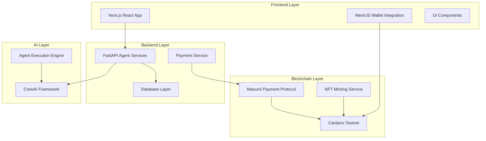

# Design Document

## Overview

AgentHub is a decentralized AI Agent Marketplace built on Next.js with Cardano blockchain integration. The platform consists of a React frontend for user interactions, a FastAPI backend for AI agent services, and blockchain integration via MeshJS and Masumi for payments. The system enables creators to deploy AI agents as services and users to discover, demo, and purchase access using testnet ADA.

## Architecture

### High-Level Architecture



### Technology Stack

**Frontend:**
- Next.js 15 with TypeScript
- React 18/19 for UI components
- TailwindCSS for styling
- MeshJS for Cardano wallet integration
- React Context for state management

**Backend:**
- FastAPI for AI agent endpoints
- SQLite for development/demo database
- Pydantic for data validation
- CrewAI for agent orchestration
- Background task processing for long-running jobs

**Blockchain:**
- Cardano testnet for transactions
- MeshJS Core for blockchain interactions
- Masumi protocol for payment processing
- Optional NFT minting for agent ownership

## Components and Interfaces

### Frontend Components

#### Core Layout Components
- `Layout`: Main application wrapper with navigation
- `Header`: Navigation bar with wallet connection status
- `Footer`: Application footer with links
- `Sidebar`: Optional filtering and navigation sidebar

#### Marketplace Components
- `AgentGrid`: Grid layout for displaying agent cards
- `AgentCard`: Individual agent preview with demo/buy buttons
- `AgentProfile`: Detailed agent information page
- `FilterPanel`: Agent filtering and search interface
- `PaginationControls`: Navigation for large agent lists

#### Wallet Components
- `WalletConnector`: Wallet selection and connection interface
- `WalletInfo`: Display connected wallet details and balance
- `TransactionHistory`: List of user's payment transactions
- `AssetViewer`: Display wallet assets including NFTs

#### Agent Interaction Components
- `AgentDemo`: Interface for trying agent functionality
- `AgentPurchase`: Payment workflow interface
- `AgentInterface`: Full agent interaction after purchase
- `JobStatus`: Display current agent job processing status

#### Creator Components
- `AgentCreationWizard`: Multi-step agent deployment form
- `CreatorDashboard`: Overview of deployed agents and earnings
- `AgentEditor`: Interface for updating agent configurations
- `EarningsTracker`: Display payment history and statistics

#### Admin Components
- `AdminDashboard`: Platform overview and management
- `AgentApproval`: Review and approve new agents
- `TransactionMonitor`: Monitor all platform transactions
- `UserManagement`: User account oversight

### Backend API Endpoints

#### Agent Management
```
GET /api/agents - List all available agents
GET /api/agents/{agent_id} - Get specific agent details
POST /api/agents - Create new agent (creator only)
PUT /api/agents/{agent_id} - Update agent (creator only)
DELETE /api/agents/{agent_id} - Remove agent (creator/admin only)
```

#### Agent Interaction
```
GET /api/agents/{agent_id}/schema - Get agent input schema
POST /api/agents/{agent_id}/demo - Start demo session
POST /api/agents/{agent_id}/start - Start paid agent job
GET /api/agents/{agent_id}/status/{job_id} - Check job status
POST /api/agents/{agent_id}/input/{job_id} - Provide additional input
GET /api/agents/{agent_id}/result/{job_id} - Get job results
```

#### Payment and Wallet
```
POST /api/payments/initiate - Start payment process
GET /api/payments/{payment_id}/status - Check payment status
POST /api/payments/verify - Verify blockchain transaction
GET /api/wallet/{address}/transactions - Get transaction history
```

#### User Management
```
POST /api/users/register - Register new user
GET /api/users/profile - Get user profile
PUT /api/users/profile - Update user profile
GET /api/users/agents - Get user's purchased agents
GET /api/creators/dashboard - Get creator statistics
```

#### Admin Endpoints
```
GET /api/admin/agents/pending - Get agents awaiting approval
POST /api/admin/agents/{agent_id}/approve - Approve agent
GET /api/admin/transactions - Get all platform transactions
GET /api/admin/users - Get user management data
```

## Data Models

### Core Data Models

#### Agent Model
```typescript
interface Agent {
  id: string;
  name: string;
  description: string;
  shortDescription: string;
  creator: string;
  creatorWallet: string;
  price: number; // in lovelace
  category: string;
  tags: string[];
  avatar?: string;
  isActive: boolean;
  isApproved: boolean;
  demoLimit: number;
  createdAt: Date;
  updatedAt: Date;
  nftTokenId?: string;
  inputSchema: object;
  crewaiConfig: object;
}
```

#### User Model
```typescript
interface User {
  id: string;
  walletAddress: string;
  username?: string;
  email?: string;
  isCreator: boolean;
  isAdmin: boolean;
  createdAt: Date;
  lastLoginAt: Date;
  purchasedAgents: string[];
  createdAgents: string[];
}
```

#### Transaction Model
```typescript
interface Transaction {
  id: string;
  txHash: string;
  fromWallet: string;
  toWallet: string;
  amount: number; // in lovelace
  agentId: string;
  status: 'pending' | 'confirmed' | 'failed';
  createdAt: Date;
  confirmedAt?: Date;
  blockHeight?: number;
}
```

#### Job Model
```typescript
interface AgentJob {
  id: string;
  agentId: string;
  userWallet: string;
  status: 'queued' | 'running' | 'completed' | 'failed';
  input: object;
  output?: object;
  error?: string;
  createdAt: Date;
  completedAt?: Date;
  isDemo: boolean;
}
```

### Database Schema

#### SQLite Tables
```sql
-- Agents table
CREATE TABLE agents (
    id TEXT PRIMARY KEY,
    name TEXT NOT NULL,
    description TEXT,
    short_description TEXT,
    creator TEXT NOT NULL,
    creator_wallet TEXT NOT NULL,
    price INTEGER NOT NULL,
    category TEXT,
    tags TEXT, -- JSON array
    avatar TEXT,
    is_active BOOLEAN DEFAULT TRUE,
    is_approved BOOLEAN DEFAULT FALSE,
    demo_limit INTEGER DEFAULT 3,
    created_at TIMESTAMP DEFAULT CURRENT_TIMESTAMP,
    updated_at TIMESTAMP DEFAULT CURRENT_TIMESTAMP,
    nft_token_id TEXT,
    input_schema TEXT, -- JSON
    crewai_config TEXT -- JSON
);

-- Users table
CREATE TABLE users (
    id TEXT PRIMARY KEY,
    wallet_address TEXT UNIQUE NOT NULL,
    username TEXT,
    email TEXT,
    is_creator BOOLEAN DEFAULT FALSE,
    is_admin BOOLEAN DEFAULT FALSE,
    created_at TIMESTAMP DEFAULT CURRENT_TIMESTAMP,
    last_login_at TIMESTAMP,
    purchased_agents TEXT, -- JSON array
    created_agents TEXT -- JSON array
);

-- Transactions table
CREATE TABLE transactions (
    id TEXT PRIMARY KEY,
    tx_hash TEXT UNIQUE NOT NULL,
    from_wallet TEXT NOT NULL,
    to_wallet TEXT NOT NULL,
    amount INTEGER NOT NULL,
    agent_id TEXT NOT NULL,
    status TEXT DEFAULT 'pending',
    created_at TIMESTAMP DEFAULT CURRENT_TIMESTAMP,
    confirmed_at TIMESTAMP,
    block_height INTEGER,
    FOREIGN KEY (agent_id) REFERENCES agents (id)
);

-- Jobs table
CREATE TABLE agent_jobs (
    id TEXT PRIMARY KEY,
    agent_id TEXT NOT NULL,
    user_wallet TEXT NOT NULL,
    status TEXT DEFAULT 'queued',
    input TEXT, -- JSON
    output TEXT, -- JSON
    error TEXT,
    created_at TIMESTAMP DEFAULT CURRENT_TIMESTAMP,
    completed_at TIMESTAMP,
    is_demo BOOLEAN DEFAULT FALSE,
    FOREIGN KEY (agent_id) REFERENCES agents (id)
);
```

## Error Handling

### Frontend Error Handling
- Global error boundary for React component errors
- Wallet connection error handling with user-friendly messages
- API request error handling with retry mechanisms
- Transaction failure handling with clear user feedback
- Form validation errors with inline messaging

### Backend Error Handling
- HTTP status code standardization (400, 401, 403, 404, 500)
- Structured error responses with error codes and messages
- Database connection error handling
- Agent execution timeout handling
- Payment verification error handling

### Blockchain Error Handling
- Transaction timeout handling
- Insufficient funds error messaging
- Network connectivity error handling
- Invalid transaction format handling
- Wallet signature rejection handling

## Testing Strategy

### Frontend Testing
- Unit tests for React components using Jest and React Testing Library
- Integration tests for wallet connection flows
- End-to-end tests for complete user journeys using Playwright
- Visual regression testing for UI components
- Accessibility testing for WCAG compliance

### Backend Testing
- Unit tests for API endpoints using pytest
- Integration tests for database operations
- Mock testing for external service dependencies
- Load testing for agent execution endpoints
- Security testing for authentication and authorization

### Blockchain Testing
- Testnet transaction testing
- Mock wallet testing for development
- Payment flow integration testing
- NFT minting and ownership testing
- Error scenario testing for failed transactions

### Agent Testing
- CrewAI agent functionality testing
- Input/output validation testing
- Demo vs full functionality testing
- Performance testing for agent execution times
- Error handling testing for agent failures

## Security Considerations

### Wallet Security
- Never store private keys or seed phrases
- Secure wallet connection state management
- Transaction signing verification
- Protection against wallet injection attacks

### API Security
- JWT token authentication for protected endpoints
- Rate limiting for API endpoints
- Input validation and sanitization
- SQL injection prevention
- CORS configuration for frontend access

### Payment Security
- Transaction verification before unlocking features
- Double-spending prevention
- Secure payment status tracking
- Audit trail for all financial transactions

### Agent Security
- Sandboxed agent execution environment
- Input validation for agent parameters
- Output sanitization for agent responses
- Resource usage limits for agent execution
- Creator verification for agent deployment

## Performance Optimization

### Frontend Performance
- Code splitting for route-based loading
- Image optimization for agent avatars
- Lazy loading for agent lists
- Caching for frequently accessed data
- Bundle size optimization

### Backend Performance
- Database indexing for common queries
- Connection pooling for database access
- Caching for agent metadata
- Background job processing for long-running tasks
- API response compression

### Blockchain Performance
- Transaction batching where possible
- Efficient UTXO management
- Optimized query patterns for blockchain data
- Caching for transaction status checks

## Deployment Architecture

### Development Environment
- Local Next.js development server
- Local FastAPI server with hot reload
- SQLite database for rapid development
- Cardano testnet for blockchain testing
- Mock payment services for offline development

### Production Environment
- Containerized deployment using Docker
- Load balancer for API endpoints
- Database clustering for high availability
- CDN for static asset delivery
- Monitoring and logging infrastructure

### CI/CD Pipeline
- Automated testing on pull requests
- Code quality checks and linting
- Security vulnerability scanning
- Automated deployment to staging
- Manual approval for production deployment